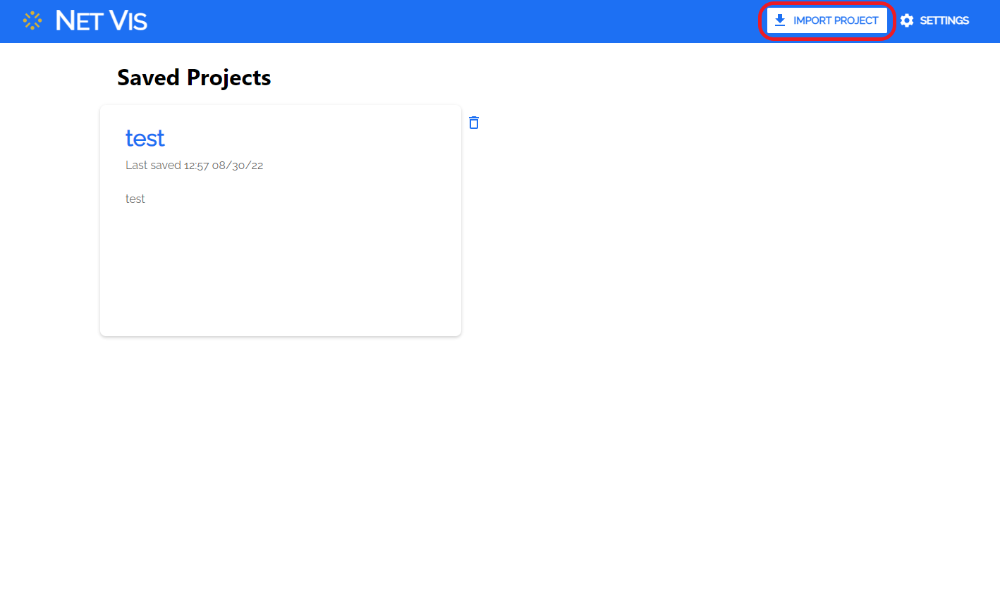
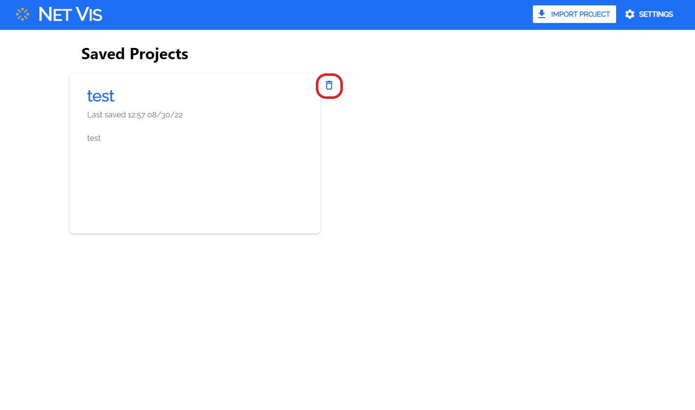

# N2N Network Visualization

GUI tool developed in Node.js/Electron to help visualize networks input/built by N2N

### Initial Installation Setup (Command Line)
1. Ensure Python, node and npm are installed on your system
2. Install graphviz: [graphviz download](https://graphviz.org/download/). **Be sure to select 'Add to PATH...' during installation.** <br/>
	1.1 To check that your PATH has been updated:<br/>
	* Windows: Search for 'environment variables' in the start menu and select 'Edit the system environment variables.' Next, press the 'Environment Variables' button. Then, under System variables, select the 'Path' variable and press 'Edit.' You should see a list of paths and the path to Graphviz should be included. If you do not see Graphviz under the System variables, check the 'Path' variable under the User variables. 
	* OS X: Open the terminal and enter the command: `echo $PATH`. You should see Graphviz included in the path variable.<br/>
3. Clone this repo
	3.1 Your file structure should look like this:<br/>
&emsp;&emsp; - \<parent directory\>
<br/>&emsp;&emsp;&emsp;&ensp; - netviz-combined
<br/>&emsp;&emsp;&emsp;&ensp; - python-glm-parse
4. Move into the netviz-combined directory <br/>
**\*NOTE: You may have issues with these next steps if you are using Git Bash, consider using the built-in terminal provided by your OS.**
5. Create python virtual env `python -m venv env`
6. Activate virtual env `source env/bin/activate` (Linux or OS X) or `.\env\Scripts\activate` (Windows)
7. Install Python dependencies `python -m pip install -r requirements.txt`<br/>
8. Install the GLM parser `python -m pip install python-glm-parse/`<br/>
9. Make sure your using stable version of Node (16.x is recommended)
10. Install node modules `npm install`

### How to Run (Command Line)

* Be sure to have your virtual environment activated. Use this command to start the app:
```
npm start
```
This provides a development experience that closely matches the final deployment. This will open an Electron window where you will find the application.
You can also access the application in your web browser at http://localhost:3000/, however, there will be limited functionality.


## Usage
### **Projects page**
When the app boots up, you will land on the Saved Projects page. This page is where you will be able to import, delete and view your saved visualization projects.
* **Importing a new visualization project**
	* To begin, click the 'Import Project' button at the top of the projects page. A modal will appear where you can upload a GLM file, an NND file or both. If you upload both a GLM and NND file, you will be able to upload a linkages file as well in order to view a combined NND or GLM visualization, but is not required. 
	* You will also be required to enter a name and description for the project. After these fields are inputted, you may click 'submit' to create and view your new project. Example files can be found in the `example_files/` directory.

**To ensure glm loads properly import statements within the selected glm files must use 'relative' paths. Netviz will iterate through all import statements in the selected glm file and try to load imported glm files using the path of the user selected glm file concatenated with the path of the glm file used in the import statement.**



* **Deleting projects**
	* Projects can be deleted from the projects page by clicking the 'trash' icon located to the right of each project card.



### **Network Visualization page**
When you import a new project or select an existing saved project, you will be taken to the network visualization page for the project. From this page you can view and edit different the different visualizations of your network(s).

* **Network Visualization Tabs**
	* Located in the top left of the page is the project info card. From here you can select one of four network visualizations: Comms, Power, Comms-centric and Power-centric.
		* Comms: This visualization allows the user to view and edit a Communications network that the user has uploaded via their NND file upload.
		* Power: This visualization allows the user to view and edit a Power network that the user has uploaded via their GLM file upload.
		* Comms-Centric: This visualization is available when a linkages file is uploaded, it shows the comms-network with labels that indicate connections to the power-network.
		* Power-Centric: This visualization is available when a linkages file is uploaded, it shows the power-network with labels that indicate connections to the comms-network.  


* **View Details menu**
	* Within the project info card at the top left of the screen, you can view the details about the project by clicking 'View Details.' This will open a modal where you can edit or add a GLM file, NND file, or linkages file for the project. You can also edit the project name and description here. Clicking 'submit' will save your changes. 


* **Nodes and Edges Panel**
	* Visible only in the comms and power views, you will find a panel on the right side that displays two lists, the top containing all nodes and the bottom containing all edges within the network.
	* You are able to view select properties of each node/edge and search for specific nodes/edges.


* **Adding Nodes**
	* At the bottom left of the pafe you will find the add node card where you can select and add nodes to your network. Nodes can be added in the comms and power views only, and the changes will be reflected in the comms-centric and power-centric views.
	* To add a node, select the type of node you would like to add. Once a node type is selected, you can click anywhere around the network and the node will be added at the location chosen. You will then be asked to fill in properties for the node, and by clicking 'submit' you will finalize the node's creation.


* **Deleting Nodes**
	* Nodes can be deleted by right clicking on a node and selecting 'remove' from the menu that appears.
	* Deleting a node will also delete all edges attached to that node. When you click 'remove' a modal will appear that lists out all edges that will be deleted with the node. By hitting 'submit', you delete the node and any attached edges. 


* **Editing Nodes**
	* Nodes can be edited by right clicking on a node and selecting 'edit' from the menu that appears. From here the user can edit select properties about the node.


* **Adding Edges**
	* To add an edge, click the 'Add Edge' button at the bottom of the screen. This will put you into Add Edge mode, you can now add an edge between any two nodes. You cannot add an edge where an edge already exists between nodes. When you add your edge, a modal will appear where you can enter some info about the edge then click 'submit' to add the edge. 

* **Deleting Edges**
	* Edges can be deleted by right clicking on an edge to bring up a menu with the option to remove the edge. Clicking 'remove' will delete the edge. 

* **Editing Edges**
	* Edges can be edited by right clicking on an edge to bring up a menu with the option to edit the edge. Clicking 'edit' will bring up a modal where you can edit the source node and destination node of the edge. Hitting 'submit' will move the edge to be between the nodes you selected. 

* **Downloading project files** (work in progress)
	* At the top right of the screen is the 'Save As' button where you can save all the edited files for the project. If you have edited, deleted, or added any edges or nodes, those changes will be saved into the new GLM or NND files you save.

* **Exporting to PDF** (work in progress)
	* At the top right of the screen is the 'Export to PDF' button where you can export a PDF of the comms network and/or power network in the state it is in at the moment. 
